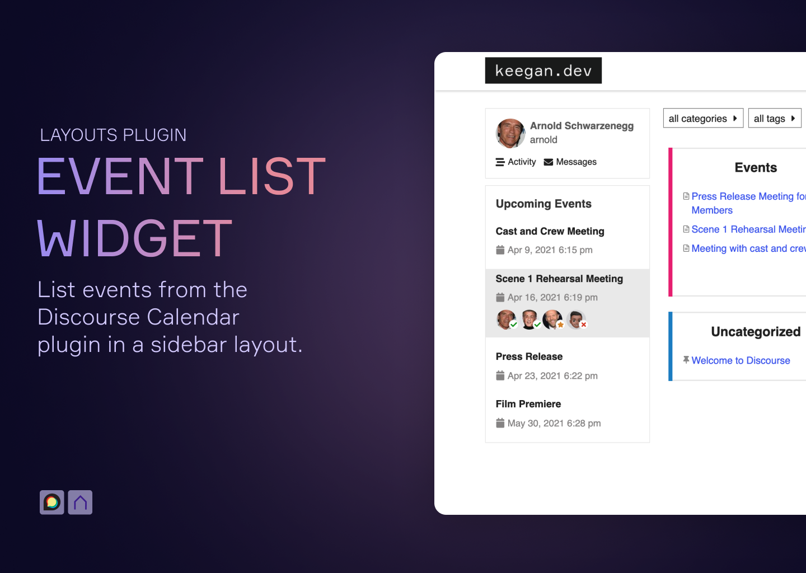
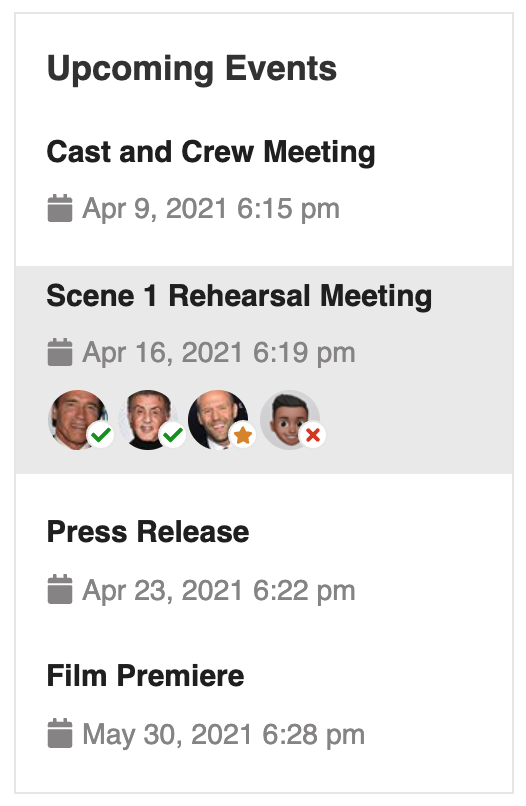
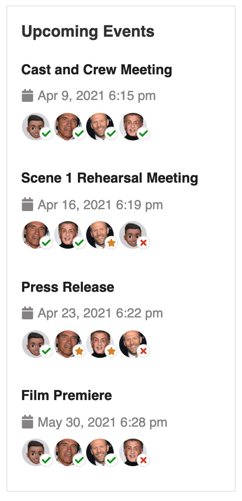
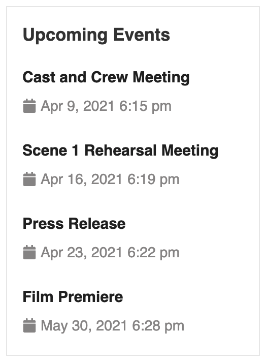
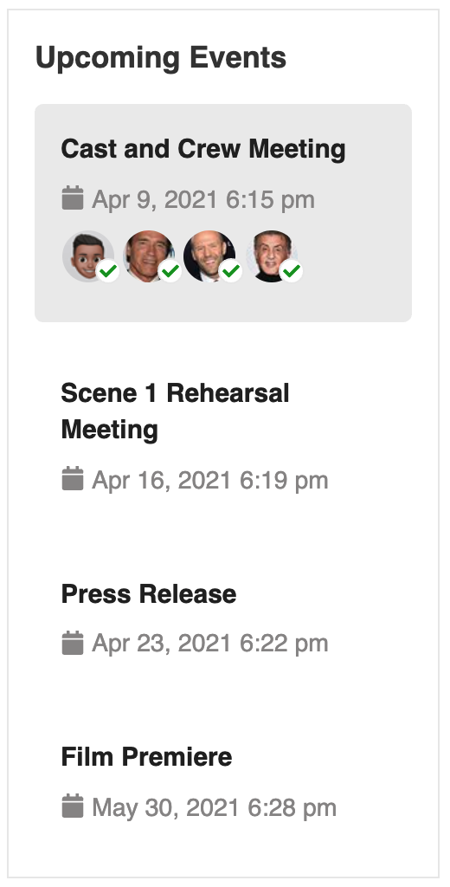
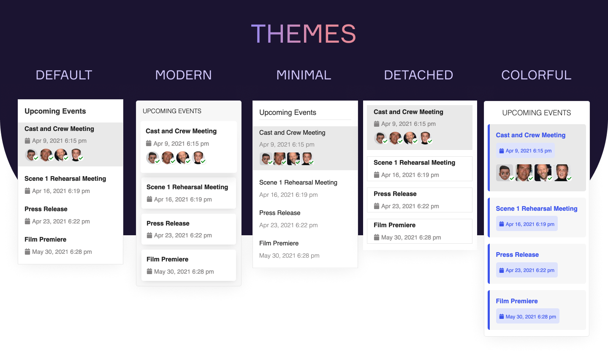

# 📅 Layouts Event List Widget

## 🔍 Overview

The Event List Widget allows you to display upcoming events created by the [Discourse Calendar Plugin](https://meta.discourse.org/t/discourse-calendar/97376) in a sidebar using Pavilion's [Custom Layouts Plugin](https://meta.discourse.org/t/custom-layouts-plugin/55208). See the [installation guide](https://thepavilion.io/t/installation-and-setup/3200) to learn how to install and administer this widget.

## 🔗 Info &amp; Links

| Title                 | Link                                                                                   |
| --------------------- | -------------------------------------------------------------------------------------- |
| ⚙️ **Widget**         | [Layouts Event List Widget](https://github.com/keegangeorge/layouts-event-list-widget) |
| 🔌 **Base Plugin**    | [Custom Layouts Widget](https://meta.discourse.org/t/custom-layouts-plugin/55208)      |
| 👨‍💻 **Author**         | [Keegan George](https://github.com/keegangeorge/)                                      |
| #️⃣ **Version**        | `1.0.0`                                                                                |
| ❓ **How to Install** | [Installation Guide](https://thepavilion.io/t/installation-and-setup/3200)             |
| 🐛 **Found a bug?**   | [Submit a bug report](https://thepavilion.io/w/bug-report/steps/intro)                 |
| ✋ **Have an idea?**  | [Submit a feature request](https://thepavilion.io/w/bug-report/steps/intro)            |

<!-- 💬 **Additional Info**| [Discourse Topic](coming-soon) -->

## ⚙️ Settings

There are a couple settings that you can configure to customize how the event list widget appears in the layout.

### 🧑‍🤝‍🧑 Toggle Invitees

Select if or how invitees will appear in the layout. You can have invitees only appear on hover (default action), keep them always shown, or disable them completely. Below are some screenshots of how each type looks on the default theme.

| Disabled                                                         | Show on Hover                                                             | Always Show                                                           |
| ---------------------------------------------------------------- | ------------------------------------------------------------------------- | --------------------------------------------------------------------- |
|  |  |  |

### 🗓️ Max Events

Select the maximum number of upcoming events to appear in the layout. You can set any number between 1 and 10.

### 📄 Style

You can configure how much room the widget takes in the layout by setting the style to: `Default`, `Compact`, or `Comfortable`. Below are examples of how it would look on the default theme.

| Default                                          | Compact                                          | Comfortable                                              |
| ------------------------------------------------ | ------------------------------------------------ | -------------------------------------------------------- |
|  |  |  |

### 🖌️ Theme

There are a few built in themes to configure your widget to look a specific way. Interesting in adding a theme? Create a pull request and add your theme in `scss/themes/yourtheme.scss`. Below are the types of themes available:

